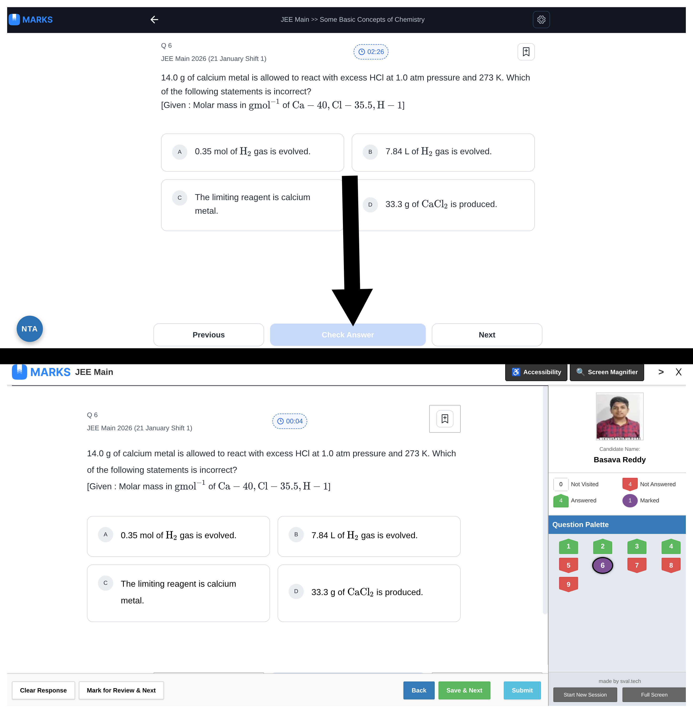

# 🎯 NTA Exam Simulator for MARKS App

Welcome! This Chrome Extension transforms the [MARKS Web App](https://getmarks.app/) into the exact **NTA (National Testing Agency)** interface used in real JEE and NEET computer-based exams. 

If you want to practice in the *exact* environment you'll face on exam day, this extension is for you!

---

## ⚠️ Disclaimer

**This is an unofficial, open-source, third-party tool.** 
This extension is **not** affiliated with, endorsed by, or sponsored by the MARKS App, MathonGo, or the National Testing Agency (NTA). 

* This extension does not bypass any paywalls or grant free access to premium content. You must have your own account and access to the MARKS app.
* It operates entirely on the client-side (in your browser) by simply applying custom CSS themes and basic JavaScript shortcuts to the existing DOM. No data is collected, and no servers are harmed.
* **Use responsibly:** : **Do not use the keyboard shortcuts to spam the servers at bot-like speeds, as this may trigger automated anti-bot protections on the website. Use at your own risk.**

---

## 🛠️ How to Install (For Beginners!)

Since this is a custom extension, it is not in the Chrome Web Store. Don't worry, installing it takes exactly 1 minute!

### Step 1: Download the Extension File
1. On the right side of this GitHub page, look for the **Releases** section and click on the latest release.
2. Under the "Assets" heading, find and click on the file ending in **`.crx`** (e.g., `marksapp.crx`) to download it. 
3. The file will download to your computer (usually in your `Downloads` folder). 
*(Note: If Chrome gives you a warning that "Extensions cannot be added from this website", just click "Keep" or ignore it—we are going to install it manually in the next steps!)*

### Step 2: Open Chrome Extensions
1. Open Google Chrome.
2. Click the **Puzzle Piece icon** 🧩 in the top right corner of your browser (next to your profile picture).
3. Click **"Manage Extensions"** at the bottom of the menu. 
   *(Alternatively, type `chrome://extensions/` into your URL bar and hit Enter).*

### Step 3: Turn on Developer Mode
1. Look at the **top right corner** of the Extensions page.
2. You will see a toggle switch that says **"Developer mode"**. Turn it **ON**. 
*(Chrome requires this to be on when installing extensions from outside the official Web Store).*

### Step 4: Drag and Drop to Install
1. Open the folder on your computer where your `.crx` file downloaded.
2. Simply **drag and drop** the `.crx` file directly onto the open Chrome Extensions page.
3. A small warning box will pop up asking if you want to "Add NTA Exam Simulator?". Click **"Add extension"**.

🎉 **Boom! You're done.** The extension is now installed.

---

## 🚀 How to Use the Simulator

1. Go to the [MARKS web app](https://getmarks.app/) and open a question bank or custom test.
2. Click the **Puzzle Piece icon** 🧩 in Chrome and click the **Pin icon** 📌 next to "NTA Exam Simulator" so it stays on your toolbar.
3. Click the Extension icon on your toolbar.
4. Click the **"Enable Interface"** switch to turn it ON. (You may need to reload the page to see the effects).
5. Watch the screen magically turn into the NTA exam portal!

### ⚙️ Personalize Your Profile
In the extension popup window, you can type in your **Name**, **Exam Name** (like JEE or NEET), and paste a link to an image for your **Profile Picture**. Click **"Save Profile Data"** to see it update on the sidebar!

---

## ⌨️ Keyboard Shortcuts (Pro-Tips)

To make your mock test practice incredibly fast, use these keyboard shortcuts instead of your mouse:

* Press **`1`**, **`2`**, **`3`**, or **`4`** (or `A`, `B`, `C`, `D`) ➔ Instantly selects the option.
* Press **`Enter`** ➔ Submits the answer / Checks the solution.
* Press **`Right Arrow (→)`** ➔ Save & Next (Goes to the next question).
* Press **`Left Arrow (←)`** ➔ Goes to the previous question.

*Bonus Trick:* If you are at the bottom of a question page, simply scroll down using your mouse wheel/trackpad, and it will automatically trigger "Save & Next" for you!

---

## 🧰 Troubleshooting

* **The page looks weird or broken!**
  * Sometimes the page needs a fresh start. Click the extension icon and hit the big red **"WIPE ALL DATA & RELOAD"** button.
* **The shortcuts aren't working!**
  * Make sure you aren't currently clicked inside a text box or search bar. Click anywhere on the blank background of the page and try again.
* **I want to exit NTA mode.**
  * Just click the extension icon and turn OFF the "Enable Interface" toggle. OR you can press the cross button on top right of the page.

---
*Created to help you crush your exams. Good luck!* 🎓